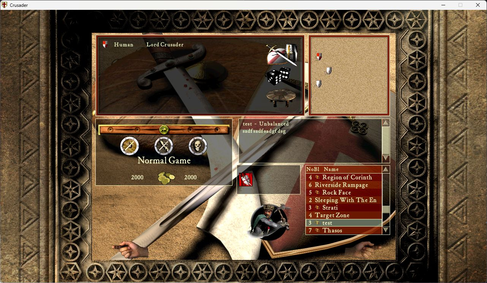
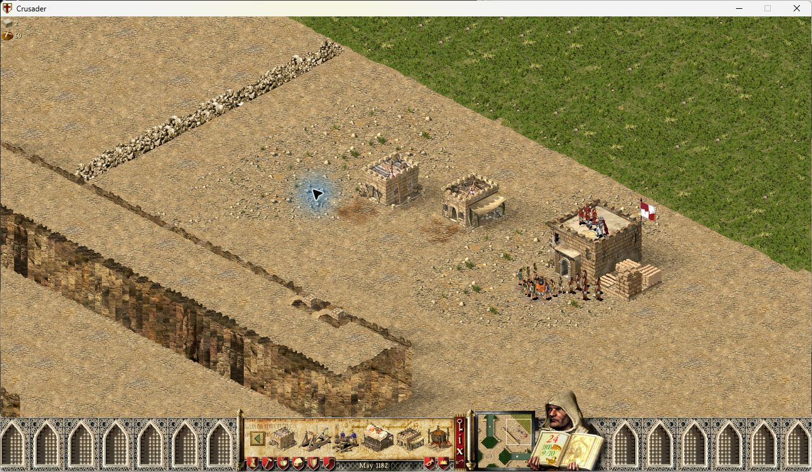
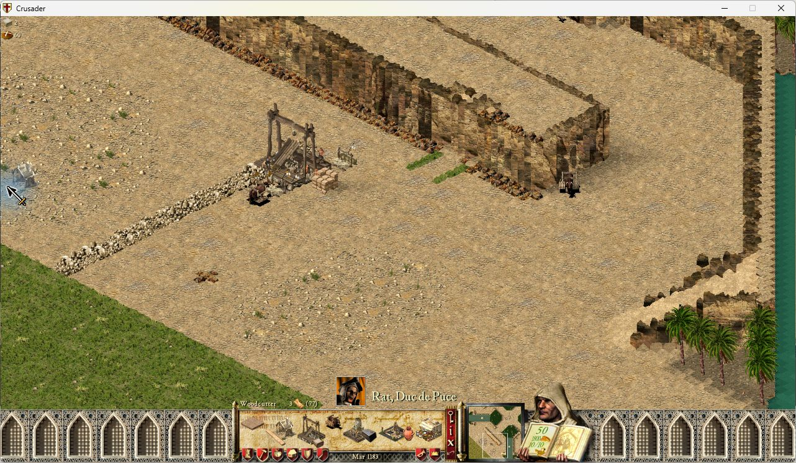
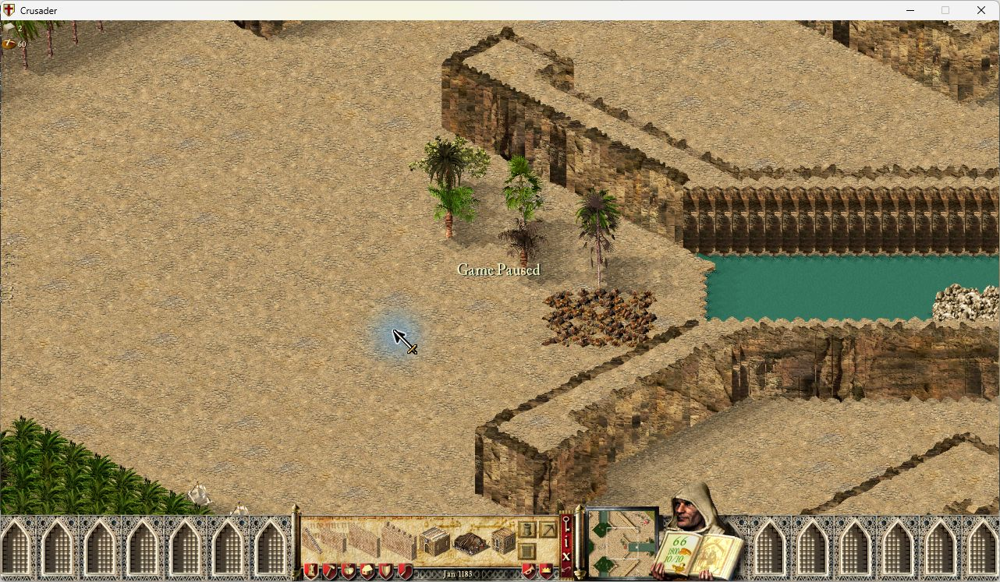
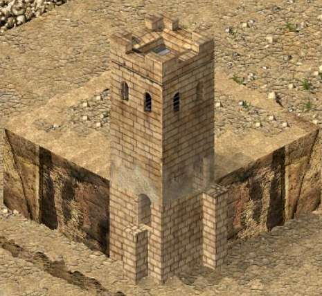
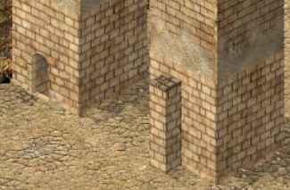
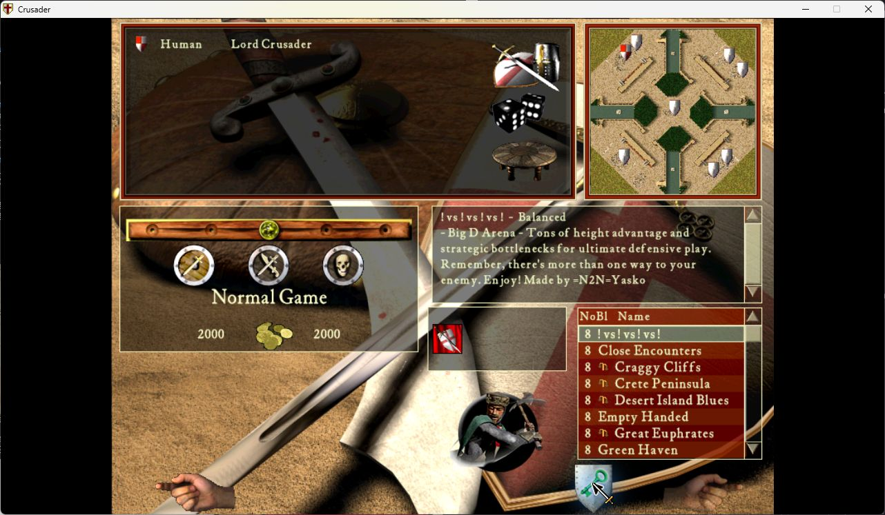
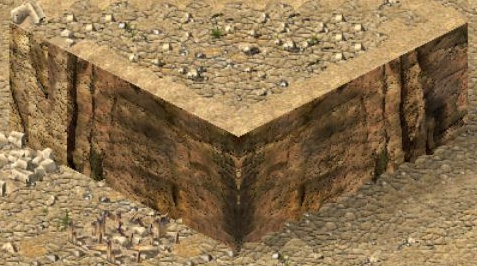

# Interface and Visual Fixes

Seven optional fixes for Stronghold Crusader and Crusader Extreme 1.41, using the game's existing
controls, text areas and artwork.

Version 0.1.4 improves diagonal cliff textures. All seven fixes remain enabled by
default, with Extreme and taller-texture support. Each fix can still be disabled
separately. Existing explicit choices in saved configurations remain in effect.
See the [short description](locale/description-en.md).

- **Show lobby map descriptions:** keeps custom descriptions visible when
  switching between custom and shipped maps.
- **Clear unique-building preview after placement:** deselects the marketplace,
  barracks, mercenary post and guilds after successful placement. Failed attempts
  can be retried; ordinary buildings and granary expansions keep repeat placement.
- **Show building previews while scrolling:** updates the existing preview while
  the camera moves.
- **Distinguish dead tree stages:** shows standing-dead art before fallen logs,
  without changing tree growth or saved state.
- **Align tower doors with connecting walls:** moves each doorway to the highest
  connected wall on its side, choosing the nearest to the side centre when heights
  tie. The doorway moves along the face as well as vertically; exposed cliffs
  beneath towers use the existing wall masonry.
- **Show Load in skirmish lobby:** makes the existing single-player Load control
  visible between the portrait and Start, including lobbies without an AI opponent.
- **Continue cliff textures after rotation:** makes cliff textures advance along
  both visible faces when the map is rotated, using the current texture pack,
  including taller cliff strips.

Enable the module, apply your settings and restart the game. All seven fixes
start enabled; switch off any you do not want. The module targets UCP 3.0.7 with
SHC or SHCE 1.41.

## Feature screenshots

### Lobby map descriptions

### Unique-building placement

### Camera movement

### Dead trees

### Tower doors

Highest wall wins on each side; among equally high walls, the connection nearest
the side centre wins. An exact tie uses the first tile in native boundary order.
A higher off-centre wall takes priority over a lower centred wall. Updated native
screenshots below show this selection and horizontal positioning.

Outermost connections place the door half a tile inward from the corner.
Ground-level stair6 connections work on their own; raised stair1–5 do not count.
Exposed cliffs beneath tower footprints use the current wall textures. Lower
connections create doors at their own height where that masonry backs the door.
Bare terrain and raised stairs do not supply doors.

If the selected high connection is removed, the door follows another high
connection before considering a lower one. The nearest-to-centre rule breaks
ties only between connections at the same height.

See [the native gallery](docs/r023/README.md) for the half-tile inset on wider towers.
Selection uses the game's existing connection refresh; warm drawing reads a
cache without rescanning walls. The measured added draw cost was about 0.024 ms for
1000 synthetic tower records. Foundation textures reuse the existing graphics
refresh and drawing pass. See [foundation validation](VALIDATION-TOWER-FOUNDATIONS.md)
for method and limits.

### Single-player lobby Load

### Cliff textures

Cliff textures continue across both faces in all four map orientations. The fix
uses the current texture pack and the existing drawing passes. Converted strips
are cached; repeated tile draws do not reprocess their pixels.

Front-facing diagonal steps use consecutive left/right strips: `[1|2] [3|4]`.
Straight sides advance one strip at a time. Steps receding into the view use
stable variation where their overlapping faces cannot form a continuous strip.

See [the current comparison, compatibility checks and measured cost](VALIDATION-CLIFF-UV.md).
See [diagonal sequencing and its native validation](VALIDATION-DIAGONAL-CLIFFS.md).

## Validation

Native screenshots come from an isolated SHC 1.41 test installation with UCP3.0.7,
winProcHandler0.2.0 and graphicsApiReplacer1.3.0. Exact revisions, tests and limits:
[R007](VALIDATION-R007.md), [R130](VALIDATION-R130.md),
[R132](VALIDATION-R132.md), [R019](VALIDATION-R019.md),
[R023](VALIDATION-R023.md), [tower foundations](VALIDATION-TOWER-FOUNDATIONS.md), [R001](VALIDATION-R001.md),
[cliff textures](VALIDATION-CLIFF-TEXTURES.md).
Automated and original-code tests are distinguished from native results;
multiplayer, replay and broader compatibility are not inferred from them.
