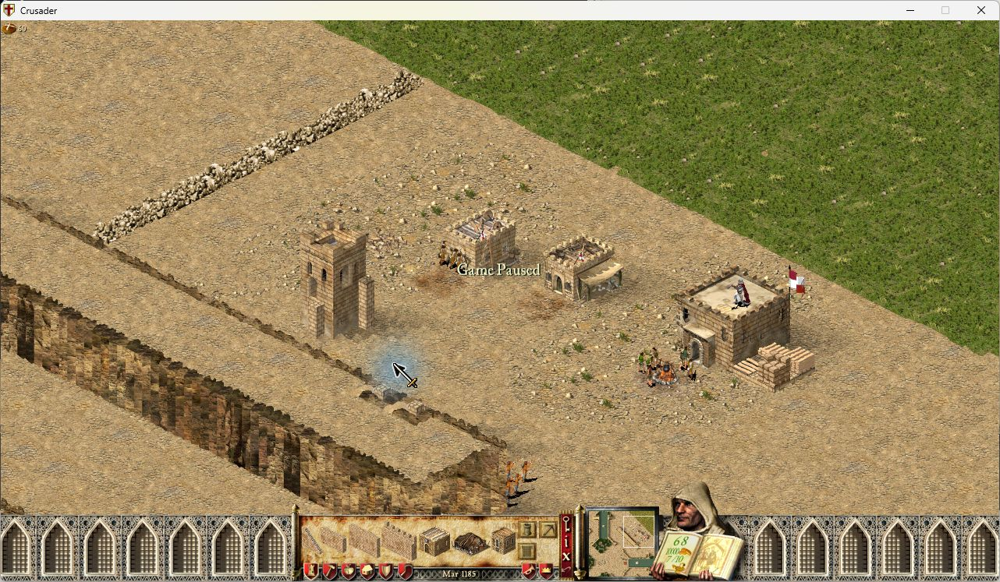

# Interface and Visual Fixes

Six optional fixes for Stronghold Crusader 1.41, using the game's existing
controls, text areas and artwork.

- **Show lobby map descriptions:** keeps custom descriptions visible when
  switching between custom and shipped maps.
- **Clear unique-building preview after placement:** deselects the marketplace,
  barracks, mercenary post and guilds after successful placement. Failed attempts
  can be retried; ordinary buildings and granary expansions keep repeat placement.
- **Show building previews while scrolling:** updates the existing preview while
  the camera moves.
- **Distinguish dead tree stages:** shows standing-dead art before fallen logs,
  without changing tree growth or saved state.
- **Align tower doors with wall height:** adjusts the existing door overlays to
  the highest connecting wall on each side, without moving the tower.
- **Show Load in skirmish lobby:** makes the existing single-player Load control
  visible between the portrait and Start, including lobbies without an AI opponent.

Enable the module, choose the fixes you want, apply your settings and restart the
game. Each option starts disabled. The module targets UCP 3.0.7 and SHC 1.41.
Extreme support is not declared.

## Feature screenshots

### Lobby map descriptions

### Unique-building placement

### Camera movement

### Dead trees

### Tower doors

## Validation

Native screenshots come from an isolated SHC 1.41 test installation with UCP3.0.7,
winProcHandler0.2.0 and graphicsApiReplacer1.3.0. Exact revisions, tests and limits:
[R007](VALIDATION-R007.md), [R130](VALIDATION-R130.md),
[R132](VALIDATION-R132.md), [R019](VALIDATION-R019.md),
[R023](VALIDATION-R023.md), [R001](VALIDATION-R001.md).
Automated and original-code tests are distinguished from native results;
multiplayer, replay and broader compatibility are not inferred from them.
