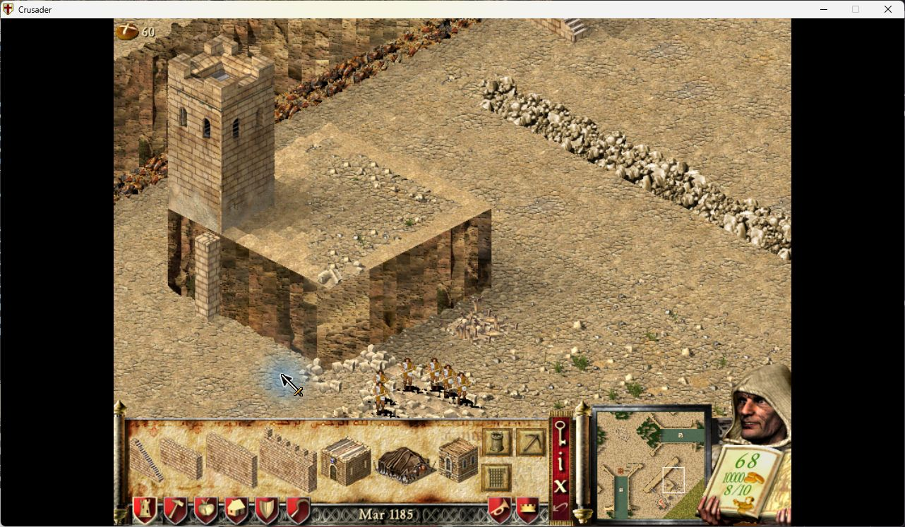

# Interface and Visual Fixes

Seven optional fixes for Stronghold Crusader 1.41, using the game's existing
controls, text areas and artwork.

- **Show lobby map descriptions:** keeps custom descriptions visible when
  switching between custom and shipped maps.
- **Clear unique-building preview after placement:** deselects the marketplace,
  barracks, mercenary post and guilds after successful placement. Failed attempts
  can be retried; ordinary buildings and granary expansions keep repeat placement.
- **Show building previews while scrolling:** updates the existing preview while
  the camera moves.
- **Distinguish dead tree stages:** shows standing-dead art before fallen logs,
  without changing tree growth or saved state.
- **Align tower doors with connecting walls:** moves each doorway to the highest
  connected wall on its side, choosing the nearest to the side centre when heights
tie. The doorway moves along the face as well as vertically.
- **Show Load in skirmish lobby:** makes the existing single-player Load control
  visible between the portrait and Start, including lobbies without an AI opponent.
- **Continue cliff textures after rotation:** makes cliff textures advance along
  both visible faces when the map is rotated, using the current texture pack.

Enable the module, choose the fixes you want, apply your settings and restart the
game. Each option starts disabled. The module targets UCP 3.0.7 and SHC 1.41.
Extreme support is not declared.

## Feature screenshots

### Lobby map descriptions

### Unique-building placement

### Camera movement

### Dead trees

### Tower doors

Highest wall wins on each side; among equally high walls, the connection nearest
the side centre wins. An exact tie uses the first tile in native boundary order.
A higher off-centre wall takes priority over a lower centred wall. Updated native
screenshots below show this selection and horizontal positioning.

Outermost connections place the door half a tile inward from the corner.
Ground-level stair6 connections work on their own; raised stair1–5 do not count.
A connection below the tower's base does not create a doorway in the cliff.

After removing that connection, the door follows the remaining high wall even
though a low wall is nearer the centre. The camera moved between these captures.

See [the native gallery](docs/r023/README.md) for the selected wall coordinates.
Selection uses the game's existing connection refresh; warm drawing reads a
cache without rescanning walls. The measured added draw cost was 0.031 ms for
1000 synthetic tower records; see the validation for method and limits.

### Single-player lobby Load

### Cliff textures

Cliff textures follow the direction of each face in all four map orientations.
The fix uses the existing textures and terrain graphics refresh. It adds no
render hook, drawing pass, allocation or per-frame check.

See [the comparison and validation](VALIDATION-CLIFF-TEXTURES.md).

## Validation

Native screenshots come from an isolated SHC 1.41 test installation with UCP3.0.7,
winProcHandler0.2.0 and graphicsApiReplacer1.3.0. Exact revisions, tests and limits:
[R007](VALIDATION-R007.md), [R130](VALIDATION-R130.md),
[R132](VALIDATION-R132.md), [R019](VALIDATION-R019.md),
[R023](VALIDATION-R023.md), [R001](VALIDATION-R001.md),
[cliff textures](VALIDATION-CLIFF-TEXTURES.md).
Automated and original-code tests are distinguished from native results;
multiplayer, replay and broader compatibility are not inferred from them.
