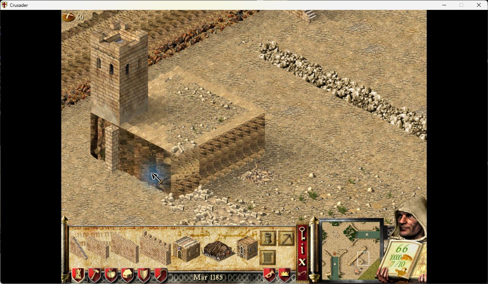

# Cliff texture direction

Issue 16: at map orientations 2 and6, the original texture selector uses the Y
coordinate for both cliff faces. A face running along X repeats a single strip
instead of advancing through the texture. Orientations0 and4 already distinguish
the axes. Texture packs can make the repeated strip more obvious, but the wrong
coordinate comes from the game, not a pack.

## Change and compatibility

`computeClimbRampRotation` 0x4FC810 classifies the visible faces before selecting
an offset. The fix replaces only its 93-byte offset calculation at 0x4FC95C,
after validating the full original signature and its address. The result feeds
the existing `updateGfxLayer` 0x509180 terrain graphics refresh. The map renderer
continues to read the same prepared graphics layer and call its existing blits.

| Orientation | Face1 | Other face |
| --- | --- | --- |
| 0 | decreasing X | decreasing Y |
| 2 | increasing Y | decreasing X |
| 4 | increasing X | increasing Y |
| 6 | decreasing Y | increasing X |

Increasing uses `(coordinate &31)+1`; decreasing uses `32-(coordinate &31)`.
The original final range clamp and epilogue remain intact. Existing correct
orientations and the already-correct face at2/6 retain their original results.
Unsupported orientations keep the original fallback. EAX classification and
callee-saved registers are preserved; only the existing texture-result field is
written. The code fits in the original space, with NOP padding and no trampoline.

There are no new assets, allocations, callbacks, render hooks, terrain scans or
simulation changes. The combined seven-option allocation total remains 66,663
bytes, entirely from the other options. The option defaults off, requires a
restart and uses UCP 3.0.7's existing assembler. It targets SHC 1.41; Extreme, MP
and replay are not certified by this test. Replacing cliff surfaces below towers
with masonry is a separate idea and is not included.

## Automated checks and native component cost

46 focused tests execute the actual Lua/FASM selector. They cover all four
orientations and six face classifications, coordinate boundaries, the unchanged
cases/fallback, exact write/register effects, signature rejection before writes
and the disabled option. The combined suite passes 821 tests, including patch-site
composition and the existing six features.

A private native probe executes the complete original 0x4FC810 function with and
without the actual patch. Its 12,800 differential cases cover four orientations,
eight neighbouring-height patterns and 400 X coordinates. Classification remains
identical; offsets match the rotated face axes and previously correct results
remain unchanged. Original game bytes are not distributed.

Five alternating pairs of one million calls per orientation measure median added
0.830ns,0.441ns,0.907ns and0.557ns for orientations 0,2,4,6 respectively. Individual
samples range from -0.980 ns to 1.779 ns, indicating measurement noise at this scale.
Even one million selector calls add less than 1 ms at each measured median. There
is no additional work in the frame renderer: this replaces an existing graphics
refresh calculation. This component measurement is not full-game FPS or a claim
of literally zero instructions/cost on every machine.

## Native comparison

Native before/after acceptance passed on 11 September 2026. Baseline PID10388
and corrected PID16536 used SHC 1.41/UCP 3.0.7, winProcHandler 0.2.0 and
graphicsApiReplacer 1.3.0 at 800x600 with stock textures. A 12x12 plateau ends
exactly at tower 54's east/south footprint edges; adjacent high and low walls
remain below its base. Both sessions loaded the same fixture and rotated through
0,6,4,2. The corrected session enabled all seven options. ZIP SHA256:
`b105062937f014e19f52f58f9768ea02b9d6e772f0027cb75b70487fb23db6e4`.

Read-only native samples confirmed the exact emitted selector, unchanged terrain
and heights, and identical pillar graphics at orientations 0/4. At orientation 6,
the previously repeated north-edge frame 5799 advances through 5786..5794 on
the ordinary cliff tiles. At orientation 2, the south edge changes from twelve
copies of frame 5807 to the sequence 5809..5798. Both visual comparisons show
the corrected direction. Special building/footprint tiles retain their existing
graphics handling. Tower doors remain absent for the below-base connections;
this separate texture-direction option does not change that selection.

| Orientation | Before | After |
| --- | --- | --- |
| 0, unchanged | [Screenshot](docs/cliffs/before-0.png) | [Screenshot](docs/cliffs/after-0.png) |
| 6, corrected | [Screenshot](docs/cliffs/before-6.png) | [Screenshot](docs/cliffs/after-6.png) |
| 4, unchanged | [Screenshot](docs/cliffs/before-4.png) | [Screenshot](docs/cliffs/after-4.png) |
| 2, corrected | [Screenshot](docs/cliffs/before-2.png) | [Screenshot](docs/cliffs/after-2.png) |

Before: the right-hand cliff face repeats one texture strip after a quarter turn.

After: the same face advances through the existing texture. The simulation time
differs between captures; terrain, wall and tower geometry are identical.

The corrected game closed normally and the desktop was released at 12:23:41 CEST.
Texture-pack independence follows from retaining the existing GM sheet and frame
range; the screenshots verify stock assets, not a separate Reconquista session.
