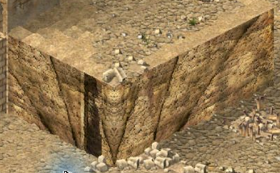

# Cliff texture source correction

Stock native visual acceptance passes. An alternative-pack check is pending;
this candidate is not a published update. Issue16 remains open.

## Cause

The earlier rotation-only selector still leaves visible seams. GM9's rock images
are30x160 raw pixels. The native cliff blitters use columns0..15 on one face and
14..29 on the other; selecting successive complete images therefore skips part
of the texture pattern on each face. Source strips already contain a vertical
skew, while the native blitters also position column pairs on an isometric slope.
Changing only the image index cannot repair those omitted source coordinates.

The candidate maps a complete source strip onto each16-column visible face,
mirrors the opposite face, and removes the source skew. Both existing native
blitters retain destination skew, clipping, zoom and vertical repetition. A
rotated x+y phase advances along both adjacent map axes and agrees at their
corner. All32 rock strips are used; the old clamp duplicated frame1 instead of
allowing32. The existing terrain graphics refresh still stores the frame choice.

## Ownership and compatibility

The in-place selector remains0x4FC95C/93bytes. Source resolution is replaced at
0x453BDB/30bytes and0x45417B/32bytes, inside the two existing blitters. It adds no
draw calls or render pass. Original source pointers and pixels are never changed.
GM9 rock images1..32 must have the native30x167header and9600byte payload;
other images and incompatible sizes pass through. Waterfalls and GM10 masonry
pixels are not converted. RGB555/565 words are copied without interpreting colour.

render-frame.lua owns the single existing0x4E8CF0 frame hook, shared with the
tower-door presentation cache. Tower connection refresh is unchanged. The new
strip cache retains a private source copy and projected copy. A visible strip is
compared once per frame, with conversion only when bytes change. Repeated tile
draws read the cached copy; invisible strips do no work. At most307200sourcebytes
are compared per frame. Byte comparison intentionally supports individual image
replacement, reset, in-place changes and allocator address reuse without taking
ownership of another module's resources or requiring its undocumented internals.

Combined seven-option allocations:774030bytes (149494before this correction).
The shared frame entry is allocated once with either feature enabled alone or
both enabled. No state is serialized and no simulation/RNG paths are modified.

## Verification so far

945 automated tests pass. New emitted-x86 tests cover complete source-strip
coverage, shared corner pixels, both colour-word formats, no repeated source
reads in a frame, image replacement/reset/address reuse, unsupported dimensions,
waterfall pass-through, exact AOB guards and the combined non-overlapping patches.

An MSVC2005SP1 native component test runs the original453B00 and454080 blitters
with the emitted patch. Its32pixel-buffer comparisons cover both blitters, all
four face masks, both zoom levels and top clipping. Patched output matches the
original blitter drawing the corresponding projected synthetic source exactly.

Seven alternating timing pairs each execute1000frames with1000source resolutions
per frame, including verification of all32strips. Median added cost is0.070443ms
per frame (range0.069226..0.078328ms). This isolates source-resolution work, not
full-game FPS or a1000-speed simulation. Conversion occurs only on changed data.
Private reproduction: R023/run_cliff_uv_benchmark.py and cliff-uv-benchmark/.
Original executable SHA256:3bb0a8c1e72331b3a30a5aa93ed94beca0081b476b04c1960e26d5b45387ac5a.

The isolated native PID23340 loaded the exactb3c276f candidate with all seven
options, SHC1.41/UCP3.0.7, winProcHandler0.2.0 andgraphicsApiReplacer1.3.0. The
stock cliff-corner fixture passes in all four rotations and Z zoom. Both faces
continue the rock pattern through the corner; tower masonry and lower doors
remain intact. Original stock GM9 stayed byte-identical on disk. Native captures
are native-cliff-uv-stock-{0,6,4,2,zoom}.png; geometry/viewport sampling records
zoom1/orientation2. The game closed normally and its process exited before the
desktop was released at17:00:49.

Remaining: alternative-pack native check; final CI/review and focused merge;
0.1.2 Store/wiki update. Resource-swap/reset cases above are emitted-x86 tests;
they are not a claim of a native textureSwapper UI session.
