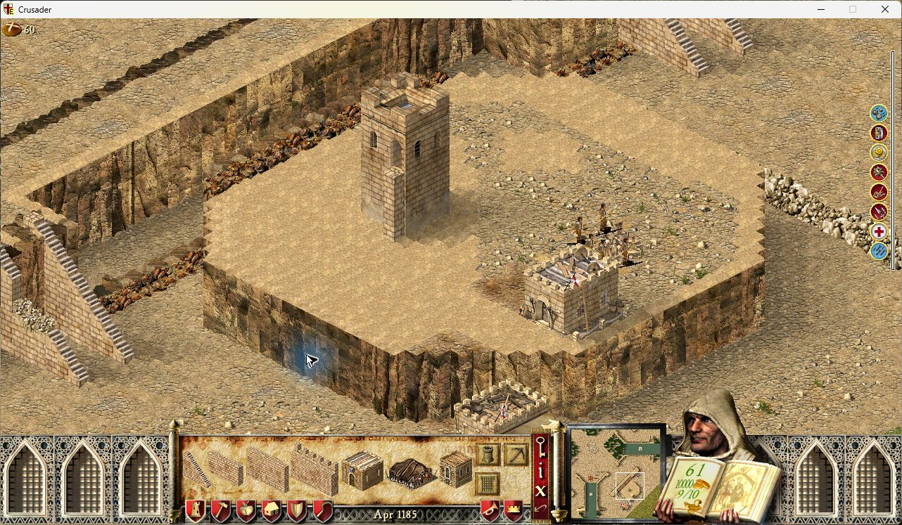

# Diagonal cliff sequencing

Validated candidate; release is tracked separately from this correction.

Version 0.1.3 assigned one index to both visible faces. Its rotated x+y phase
advanced along straight sides but stayed constant on one diagonal. The opposite
diagonal skipped an index between tiles while duplicating each tile's two faces.
The bank contains 32 rock strips, followed by non-rock/waterfall images.

The candidate uses the horizontal projection x-y, -x-y, y-x, or x+y for rotations
0, 2, 4, or 6. A native column contains complete consecutive strips in screen
order: its left half uses N and its right half N+1, with 32 wrapping to 1.

```text
Straight boundary:       1 -- 2 -- 3 -- 4
Front-facing staircase: [1|2] [3|4] [5|6]
```

Staircases extending directly into the view overlap in depth at constant screen
X. During the existing terrain refresh, the selector checks only the immediate
forward/back diagonal neighbours for equal effective height and the same exposed
side. Those steps use deterministic coordinate variation. This is not a boundary
walk, per-frame check, random-number call or new per-tile cache. Wall tiles use
the terrain height, matching the original face classifier.

The two existing blitter hooks still own source conversion. Their two native
image globals continue serving vertical layering; they are not repurposed as
left/right inputs. Each cached projection pairs adjacent validated source copies.
A source change invalidates its own pair and the preceding pair. Originals are
compared once per render frame, even when shared by two pairs; storage remains
one source copy plus one projection per image. No draw call or frame hook is added.
If a neighbour is unavailable or has different dimensions, the validated current
strip supplies both halves until compatible data returns. Non-rock images retain
the native source; original resource pointers and pixels remain untouched.

Automated: 1,395 tests pass, including straight sides, both staircase directions,
all rotations, stable variation, wraparound, neighbour changes and cache sharing,
source bounds at 11 heights, allocation failure and all seven existing fixes.
Original SHC and SHCE native blitters each pass 160 nonempty full-surface pixel
comparisons across five strip heights (160, 240, 320, 511 and 1024 rows), both
blitters, four face masks, both zooms and top clipping. Each edition also passes
240 full original-selector comparisons: unchanged native face classification and
correct phases for straight, front and depth boundaries in all four rotations.
The selector write check permits only its stack and original graphics-phase field.

Native game acceptance used runtime 5986ad64fb67e7b092aa081538ab356e2d0115c5,
SHCE 1.41 (SHA256 55648e6b05d67d37a5773fe699bbb17a2d6ad4de1bb9dbded9a21caef82bd7fb),
UCP 3.0.7, winProcHandler 0.2.0, graphicsApiReplacer 1.3.0 and all seven fixes on.
The isolated octagonal fixture contains straight sides and both staircase slopes.
All four orientations and both zoom levels were inspected with stock textures.
The front staircase that repeated strip 23 in 0.1.3 now starts with strips
15, 17, 19, 21, 23, 25, 27, 29, 31; the other face uses the next strip. Read-only
native snapshots confirm the two-step progression and wraparound in every rotation.
The existing cliff-corner fixture still shows the lower door in front of the
tower's masonry. Tests closed normally and released the shared desktop.



Seven alternating native million-call runs measured added selector cost against
0.1.3: median 6.5–20.2 ns per graphics refresh in SHC and 8.8–18.6 ns in SHCE,
depending on boundary shape. This runs during the existing terrain refresh,
not every simulation tick. No new patch site, draw call or tile cache is added.
All seven fixes retain 21 patch sites; startup allocation grows by 638 bytes to
151,277 bytes. The source/projection pixel storage is unchanged.

With all 32 strips used and 1,000 source resolutions per frame, source conversion
and validation add median 0.112 ms (SHC) / 0.097 ms (SHCE) over the raw native
resolver at stock height, or 0.164 / 0.172 ms at double height. At 1,024 rows the
medians are 0.465 / 0.458 ms. Adjacent pairs share source checks: each original
is compared at most once per frame and warm draws allocate nothing. These are
component measurements, not a whole-game FPS or 1,000-speed simulation claim.

Regular-edition comparisons execute original native code; this follow-up's
interactive game acceptance was in Extreme. The unpublished taller artwork is
for its author's later check; synthetic heights verify bounds and rendering
without assuming that private pack's pixels. Multiplayer and replay are not
inferred from these presentation tests.
