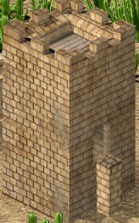
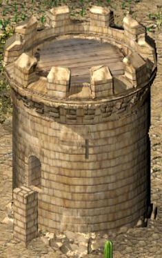

# Lower door draw order: candidate validation

Related to [issue 19](https://github.com/Krarilotus/extension-interface-visual-fixes/issues/19).
The user's screenshots disproved the earlier complete visual acceptance in
`VALIDATION-TOWER-FOUNDATIONS.md`. In particular, the last foundation column
could cover a lower doorway. The previous screenshots are historical evidence,
not proof that this defect or the separately reported cliff seams are resolved.

## Cause and correction

The native tower overlay can run before all foundation columns have been drawn.
In the `iv-cliff-corner` reproducer, the left door's original draw at (522,290)
is followed by its tower's column at (534,392). The latter overwrites 289 of the
door's 791 opaque pixels. The height lookup is identity at the relevant heights;
changing the vertical height conversion would not fix this ordering problem.

The candidate retains a below-base doorway until its own foundation has been
painted through the sprite's horizontal extent. It emits the original sprite
call exactly once. Connection selection and its existing cache are unchanged.
Presentation state expires at each native map-render entry so clipped pending
doors cannot leak across frames, camera movements or loads.

New guarded patch sites are map-render entry `0x4E8CF0` and the existing foundation
column call `0x4EBA52`. All signatures are validated before any write. No new
connection scan, simulation hook, asset or separate render pass is added.
The seven-option allocation is 149,494 bytes, an increase of 82,478 bytes,
including an 81,924-byte presentation cache. It is never serialized.

## Completed checks

945 combined tests pass. The emitted x86 regressions cover both door faces,
waiting for the correct tower column, exactly one draw, already-painted backing,
frame expiration, unchanged registers/flags and restoration of native drawing
state. Existing connection ranking, placement, camera and composition tests pass.

The isolated native test used SHC 1.41 / UCP 3.0.7, all seven options,
winProcHandler 0.2.0 and graphicsApiReplacer 1.3.0. Reference executable SHA256:
`3bb0a8c1e72331b3a30a5aa93ed94beca0081b476b04c1960e26d5b45387ac5a`.
The loose development module was the candidate, not published version 0.1.1.

The fixture places tower54/type75 at (204,86), width4, base104, flush with two
plateau edges. The east wall is at terrain8/top98; the south wall is at
terrain8/top68. Native captures and a bounded call trace from PID18720 cover
orientations 0,6,4,2. The trace records four visible doorway draws across those
views. A pixel-write audit finds zero doorway pixels overwritten by subsequent
recorded columns in each view. This audit does not model other scene occluders.
The native game is closed; no diagnostic probe belongs in the release package.

## Cost and remaining gates

An MSVC2005 SP1 native component benchmark executes the emitted x86 using 1,000
synthetic tower records and seven alternating baseline/candidate timing pairs.
Each arm makes one million column calls. Median added bookkeeping is 6.381 ns
per non-tower column, 8.139 ns per warm tower column, 8.053 ns for a tower's first
column in a frame, and 11.296 ns for flushing one pending door. Both arms use
empty draw terminals to isolate bookkeeping; the flush case includes the sprite
call but does not render pixels. These are component costs, not full-game FPS or
a tested 1000-speed simulation setting.

The final anchor correction derives each face centre from the parent renderer's
actual draw coordinates and footprint width. The previous fixed sprite anchors
were not centred consistently between tower kinds. The door now moves by half a
tile at the extreme connection, to one-based positions 1.5 and N-0.5, for widths
4, 5 and 6. Highest connection first, centre breaking ties remains unchanged.

The original four-argument tower renderer was probed for all four kinds. Its
reference tile is origin+(N-2,N-2), independently of kind. Executing that original
function with the final patch passes 32 cold/warm draw checks across four kinds
and four rotations. A separate native benchmark measures median added warm draw
cost 23.808 ns per tower (0.023808 ms per 1,000 records), and connection refresh
194.237 ns per record. The latter uses the existing refresh, not every frame.
These are component measurements with empty draw terminals, not FPS claims.

Native sessions PID5160 and PID13596 checked the final door code: the cliff-edge
small tower, camera-only copies of an existing save containing width5, width6
square and width6 round towers, full scale and Z zoom, all four rotations,
viewport-clipped towers and save reloads. The AI fixture built stair6 (mapper186,
logic0x8100, height8) beside tower51 and raised stair1 (mapper181, logic0x900,
height88) beside tower28. Only stair6 produces the ground-level doorway; masonry
backs it. The raised stair produces no doorway. Both native sessions are closed.

Cliff seams remain separately open in issue 16. Do not publish the final Store
patch or reuse old cliff screenshots as acceptance until that correction passes.
