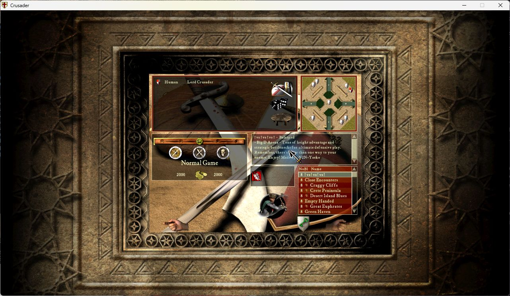
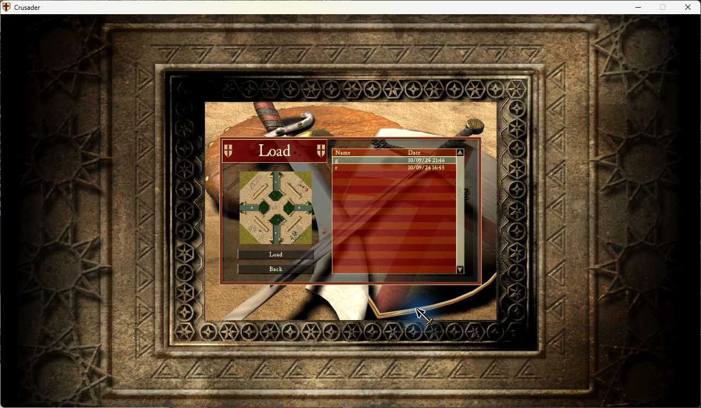

# Single-player lobby Load (R001)

The native Load item exists in the lobby but its renderer skips single-player
skirmish. Its action also uses Start's valid-team-count gate, blocking human-only
loading. This optional correction draws the original icon and accepts the Load
action in single-player without requiring an AI opponent. Host/readiness,
modal/transition guards and every original loader/navigation operation remain.

Implementation scope: SHC1.41 only. Load renderer JE at0x42afb9 goes to the
existing active-button block0x42affd for mode99; all other modes fall through
unchanged. Load-only compare/branch at0x4426e0 redirects through27bytes that
exempt mode99 and preserve the original comparison for all other modes. Start's
separate comparison and shared team helper are untouched. The existing menu
table, pixel hit test, GM art and localized tooltip are reused. No menu/cffi
dependency, additional input hook, polling, save/state/serializer change.

The user also requested a single-player-only position correction after noticing
the master portrait overdraws the icon. Lobby preparation at0x42733a..0x427343
now sets the existing Load item's x at0x5e998c to560 for mode99 and restores444
for every other mode. Its y remains540. A46-byte wrapper preserves flags and
registers and replays the original secondary-mode write. Both native drawing
and alpha hit testing read the same item; no render-time position update is used.
Original normal/hover Load frames are45x58, the master portrait spans
x409..529/y452..553 and Start's native hit rectangle begins atx620.
The new Load rectangle x560..605/y540..598 fits the800x600 menu canvas.

Integration: sibling of R130 based on R007a765ded, approved by the Interface
owner in PR2 comment5626163468 and directly assigned by the user. R0070x4287bd
does not overlap these sites. The additional preparation hook implements the
user's subsequent explicit SP-only positioning request. Other Interface branches
remain separately owned.

## Validation completed

- Corrected package native test11 September09:26-09:31: single-player lobby
  opens; entire Load icon is clear of the master portrait, map list and Start
  hand. Clicking the old center does nothing; the new target opens native Load
  in human-only and human+Rat lobbies. Back returns correctly; g.sav loads and
  quitting that fixture returns to the lobby with the relocated icon intact.
  Native sample confirms mode99, x560/y540 and no AI in the human-only case.
  R007 description is visible alongside it. Current game configuration retains
  the previously verified1920x1080 setting; capture size is1282x746.

- 66 automated tests: existing20R007 plus46R001, actual Lua-emitted x86 branches,
  mode/team boundaries, register/stack preservation, disabled/idempotent enable,
  signature/layout rejection and option composition. Includes SP/MP navigation
  in both directions, position reset, untouched item fields, preserved flags,
  displaced instruction replay and minimum-canvas bounds.
- Private original-executable fixture:54 original-code cases and160 comparisons
  using actual Lua output through the original action/renderer/team helper,
  with terminal draw/dialog stubbed. Other tested modes0/1/2/666 compare equal;
  MP host/client, readiness, one/two players and same/distinct teams included.
  Modal/transition blocking remains. This is not a live MP test.
- Native SHC1.41 baseline reproduced human-only refusal and human+Rat hidden
  target opening. Back/reopen and g.sav load worked before the patch.
- Earlier packaged module, before repositioning, with R001 and R007 enabled:
  original Load icon visible
  in human-only and human+Rat lobbies; both open native Load; human-only Back
  returns to lobby; subsequent reopen and g.sav loading work. R007 custom map
  description appears in the same lobby. English tooltip/dialog, original art,
  but the master portrait overlaps its top13pixels. This prompted the position
  correction above; these captures do not validate the new position.
  Native video options confirm1920x1080. Captures are
  scaled1282x746 window images and are not themselves resolution evidence.

Exact test executable SHA256:
`3bb0a8c1e72331b3a30a5aa93ed94beca0081b476b04c1960e26d5b45387ac5a`.
Developer loader, official UCP3.0.7 code.zip SHA256
`ee93555d0455cde4fc68dc5434203142aa0acbc43882d819525c4077be833e00`,
winProcHandler0.2.0 and graphicsApiReplacer1.3.0, padding20. Isolated profile.
g.sav SHA256`bf32e750ea38cfaeae0bd7387fc0b133b9b8e0be06cc53aa2c6aec0dadba378e`.
Native module enable recorded2026-09-11 08:22:31; game closed and slot released
08:26:29. Logs, original-code fixtures and save hashes are retained in the
assigned workspace `Roadmap/Investigations/R001-lobby-load/evidence`.

## Remaining acceptance

Native hover/tooltip and SP-to-MP position reset; invalid save handling;
long translated game tooltip and focused MP host smoke. No native
Extreme/remote multiplayer/replay certification is claimed. Nine maintained
launcher locales (en/de/fr/ru/hu/tr/ch/es/fa) contain matching keys; independent
translation review remains pending. In-game resources follow game language,
launcher option follows GUI language.

GUI catalog integration now passes for all nine languages against both local
GUI2a644333 and upstream GUI009ee71fe3a5229e75b2dc7a10d2ef5141217bc8.
The test reads the actual runtime ZIP, checks the GUI's supported-language list,
catalog keys/nonempty UTF-8 strings and calls its real changeLocale function.
Category, title and description resolve in every locale without English fallback;
option URLs/defaults and source templates stay unchanged. CI repeats the pinned
upstream check and attaches LOCALIZATION.json with the review ZIP/checksum.
This does not claim visual GUI inspection or independent language review of all
nine translations.

The MP host attempt triggered a Windows Firewall permission prompt before lobby
entry. No security setting was changed. The isolated test process was stopped
after releasing the slot so it would not block other workers. Native MP remains
unverified; gate fixtures and mode-position tests are not a substitute for that
smoke test. Resuming that check requires manually handling the OS prompt.

Runtime package14files6113bytes, +2362bytes over R007's3751byte archive, no new
dependency.73 allocated code bytes,21 overwritten instruction bytes. Three
startup AOB lookups, one extra original button draw in the SP lobby per frame;
no per-frame allocation/scanning. Action guard executes only when Load reaches
the existing team comparison. Whole-frame and startup timing not benchmarked.
Position work runs only during native lobby preparation. Package SHA256:
`cb0924ddd410dd41b1a365344e1a14cd100581696af98db8a634a7ec9daa1980`.

The first repositioned native build exited on entering the lobby. Its replayed
MOV used a nested small integer, which UCP compiles as one byte rather than a
dword. Corrected to four explicit bytes and fixed the test compiler's matching
mistake. All66 tests pass again; a private fixture now compares emitted bytes
against the actual hash-checked UCP3.0.7 core.compile/writeCode/jmpTo at four
allocation bases. Original-code gates also pass again. Revised native retry
passed for SP as recorded above; the initial failed run is not acceptance.

PR remains draft until material native gates pass. Independent review and normal
approved merge remain required; no release or completed issue resolution.

## Interface integration acceptance, 11 September 2026

The combined package retains R001 runtime2cf64e5 and all five merged sibling
fixes. ZIP SHA2565e3146b40a7eff7e8ab26792eba08417097cb998395f6abaf558698809b35678;
18runtime files,14,964bytes. All733 combined tests and the actual nine-language
GUI resolver check pass. Shared init/options/locales/files are composed once;
no duplicated native patch or input registration. The original owner's branch
and private installation were not modified during these additional tests.

Native SHC1.41 acceptance in the Interface installation additionally passes:

- Apply800x600 in Video Options and reopen to verify the actual resolution.
  The full Load icon fits between the portrait and Start, clear of the map list;
  its visible hit area opens the existing dialog with the human alone.
- A separate profile with an empty Saves directory opens an empty native list.
  Load is disabled and an attempted click is inert; Back returns to the lobby.
- Restart with only lobby-load disabled: the original hidden-icon behavior
  returns, and clicking the relocated position is inert. R007 stays active.

Screenshots are in docs/r001. The existing saves were untouched; original
configpath and enabled configuration were restored after closing the test game.
The native desktop slot was released at10:48:53 CEST. The test profile remains
at800x600; the earlier1920x1080 acceptance is separately recorded above.

Hover did not produce a readable tooltip in the800x600 capture, with either the
enabled icon or original hidden target. This is not claimed as tooltip acceptance
or a proven regression. No translated in-game resource fixture was substituted.
The previously recorded Windows Firewall blocker still prevents native MP
acceptance; it is separate from the authorized UCP developer-mode notice.
