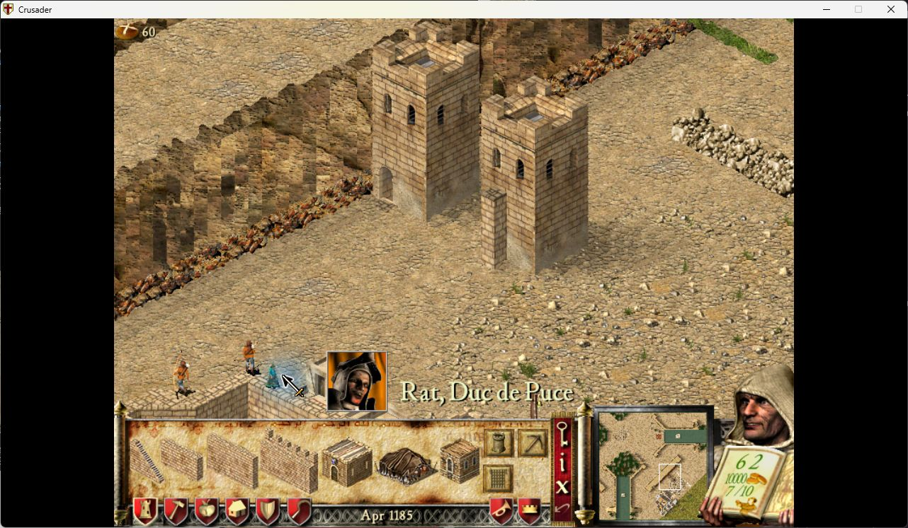
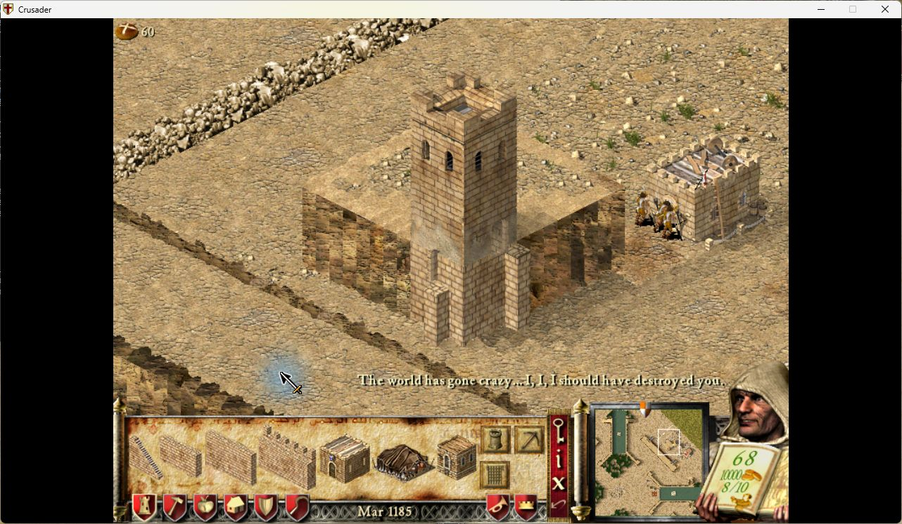
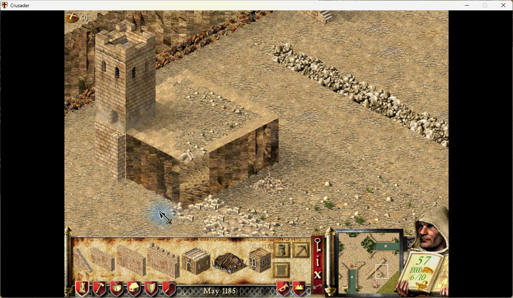
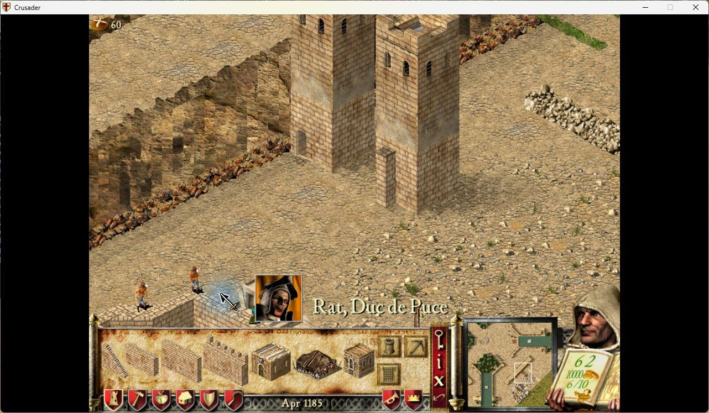

# Tower doors: native examples

The foreground square tower is the subject of the first two images. Each side
chooses its highest connected wall, then the nearest connection to that side's
centre among walls of that height. Doorways move along the face and vertically.

Two high walls and one low wall connect to the same side. The nearer high wall
at300,252 wins over the high wall at298,252 and the low wall at299,252.

After removing the selected high wall, the doorway follows the remaining high
wall at298,252. The nearer low wall does not take priority. The camera moved
between captures; compare the doorway with the connecting wall on the tower.

The smaller tower demonstrates independent sides: its high and low connections
retain different doorway heights after loading another save.

The high connection at the outermost east tile places its doorway half a tile
inward. The low connection on the south side keeps its own height.

A single stair6 connection supplies a doorway at ground level. Raised stair1–5
are excluded, even when no other wall is present.

## AI-built stairs and a tower directly on the cliff edge

The AI built both towers and their adjacent stairs from a prepared construction
plan on initially empty tiles. On the left, stair6 alone creates the ground-level
door. On the right, raised stair1 does not create a door. No wall supplies either
doorway; stair6 is an AI construction tile, not a player-buildable stair option.

The tower below stands directly at the plateau's corner. The high wall on the
right and low wall on the left remain on lower ground. The exposed tower
foundation now uses wall masonry, and both doors follow their connection heights.
The outer high connection is inset half a tile. Terrain outside the footprint
keeps its cliff texture.

The AI also built these two towers on prepared elevated terrain. Stair6 alone
supplies the ground door in the left foundation. The raised stair beside the
right tower supplies no door. The fixture prepares terrain and an AI plan; the
native AI places both towers and stairs after loading.

See [foundation validation](../../VALIDATION-TOWER-FOUNDATIONS.md) for exact
revisions, fixture values, performance and limits. These are native captures,
with no explanatory overlays or added in-game panels.
