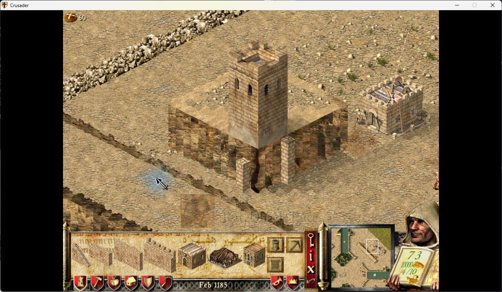

# Tower doors: native examples

The foreground square tower is the subject of the first two images. Each side
chooses its highest connected wall, then the nearest connection to that side's
centre among walls of that height. Doorways move along the face and vertically.

Two high walls and one low wall connect to the same side. The nearer high wall
at300,252 wins over the high wall at298,252 and the low wall at299,252.

After removing the selected high wall, the doorway follows the remaining high
wall at298,252. The nearer low wall does not take priority. The camera moved
between captures; compare the doorway with the connecting wall on the tower.

The smaller tower demonstrates independent sides: its high and low connections
retain different doorway heights after loading another save.

The high connection at the outermost east tile places its doorway half a tile
inward. The low connection on the south side keeps its own height.

A single stair6 connection supplies a doorway at ground level. Raised stair1–5
are excluded, even when no other wall is present.

A low wall below the tower's terrain base does not create a doorway in the cliff.
The cliff appearance itself is unchanged by the door option.

Captured in the native SHC1.41 game with the extension enabled. These are existing
game sprites; no explanatory overlays or new game panels are added. The last
four images use isolated, controlled saves: the edge case retains naturally
placed geometry, while the stair/cliff cases set the documented native tile
values offline. They verify rendering, not placement or navigation changes.

## AI-built stairs and a tower directly on the cliff edge

The AI built both towers and their adjacent stairs from a prepared construction
plan on initially empty tiles. On the left, stair6 alone creates the ground-level
door. On the right, raised stair1 does not create a door. No wall supplies either
doorway; stair6 is an AI construction tile, not a player-buildable stair option.

The tower below stands directly at the plateau's corner. The high wall on the
right and low wall on the left remain on the lower ground. Both wall tops are
below the tower's base, so neither creates a door in the cliff. This controlled
terrain fixture specifically checks the edge, not a tower set back from it.

