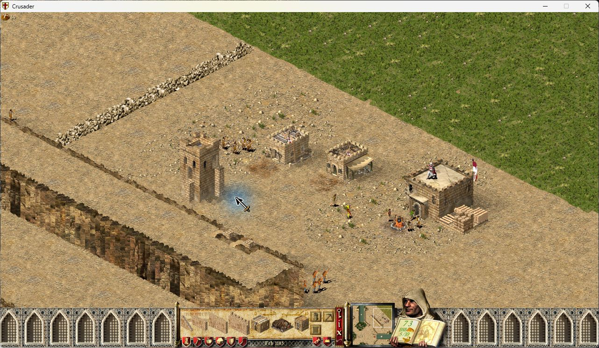

# Tower doors: native examples

The foreground square tower is the subject of the first two images. Each side
chooses its highest connected wall, then the nearest connection to that side's
centre among walls of that height. Doorways move along the face and vertically.

Two high walls and one low wall connect to the same side. The nearer high wall
at300,252 wins over the high wall at298,252 and the low wall at299,252.

After removing the selected high wall, the doorway follows the remaining high
wall at298,252. The nearer low wall does not take priority. The camera moved
between captures; compare the doorway with the connecting wall on the tower.

The smaller tower demonstrates independent sides: its high and low connections
retain different doorway heights after loading another save.

Captured in the native SHC1.41 game with the extension enabled. These are existing
game sprites; no explanatory overlays or new game panels are added.
